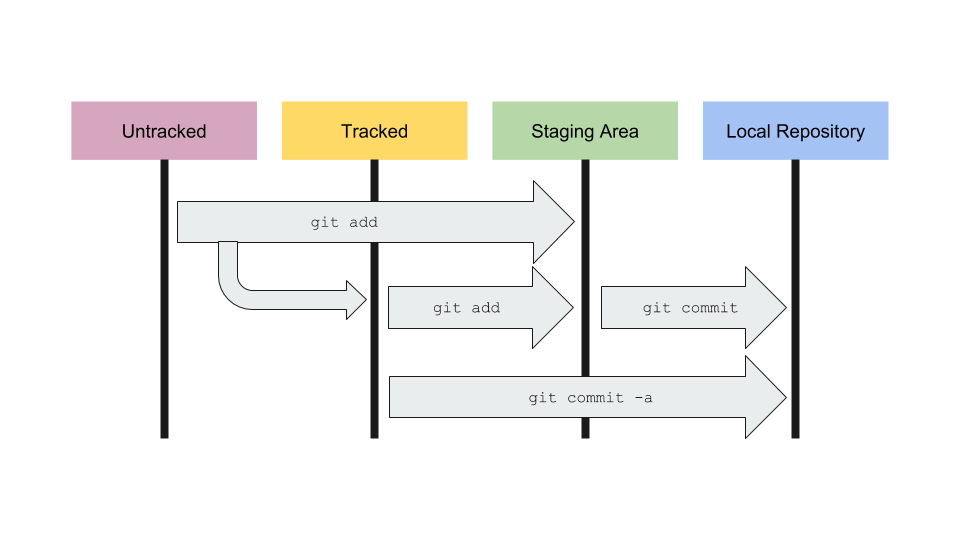

# Git Introduction

## What is a version control system?

Tool developed for software development, but very useful also for anything text based. (i.e. LaTeX).
Solution to the mess you are almost certain to see:

```plain
$ cd work/papers/precipitation_paper
$ ls -1F
old/
bak/
draft1/
draft2/
submitted/
revised/
submitted_v2/
changes_from_sarah/
changes_from_peter/
final/
final_v2/
THIS_ONE/
```

So which one is the current version?
Does the `changes_from_peter` version also contain the changes from Sarah?
Or vice versa?

A version control system gets around all this chaos.
It keeps track of all changes, the order these changes were made, and why the changes were made.

### Advantages of git

Compared to older version control systems like subversion, git has two main advantages:

1. It's almost ridiculously easy to set up.
2. Its distributed infrastructure means that it does not need a central server.
   Though it can utilise one if desired.

## Initial configuration

Every commit you do will have your name and email address attached to it.

So, before you can use `git` the first time on your computer, you have to tell it who you are.

    git config --global user.name "Holger Wolff"
    git config --global user.email "Holger.Wolff@monash.edu"

This creates a file called `.gitconfig` in your home directory with these entries:

## Using git

### Creating a new repository

As I said before, creating a repository is ridiculously easy.
Just go into that directory, and type:

```plain
$ git init .
```

And that's it.

We can now inquire about the repo:

```plain
$ git status
```

As expected, it's empty.
By the way: When you initialised the repository, the directory did not need to be empty.

`git` has created a subdirectory to track the changes:

```plain
$ ls -aF
./
../
.git/
```

### Pushing things into the repo

Let's create a shopping list:

```plain
$ nano shopping_list.txt
Eggs
Milk
Berty Bott's every-flavour beans
^O
^X
```

If we now look at the status, we see that `git` recognised there's a new file, but that file isn't tracked yet:

```plain
$ git status
On branch master

Initial commit

Untracked files:
  (use "git add <file>..." to include in what will be committed)

	shopping_list.txt

nothing added to commit but untracked files present (use "git add" to track)
```

In order to track the changes to `shopping_list.txt`, we need to add them to the repo:

```plain
$ git add shopping_list.txt
$ git status
On branch master

Initial commit

Changes to be committed:
  (use "git rm --cached <file>..." to unstage)

	new file:   shopping_list.txt
```

The file now shows up under 'files to be committed'.
This is called the staging area.
Files and file-changes can be placed in the staging area together to become part of the same commit.

So let's commit them:

```plain
$ git commit
```

And we land in an editor.
Here, in the first line, we are asked to give a brief explanation of the commit.
Note that, as the text suggests, leaving the message empty will abort the commit.

It's really important for later understanding that you give a meaningful description.

If we now look at the status, everything is 'clean':

```plain
$ git status
On branch master
nothing to commit, working directory clean
```

But we can now look at the log file of the repository to see that commit:

```plain
$ git log
commit 9ca82997e506894bd7227b8fe5d1a5a7ec43cbb5
Author: Holger Wolff <holger.wolff@monash.edu>
Date:   Mon Jul 2 11:43:29 2018 +1000

    Initial commit of shopping list
```

Let's add something else to the shopping list:

```plain
$ nano shoping_list.txt
$ git status
On branch master
Changes not staged for commit:
  (use "git add <file>..." to update what will be committed)
  (use "git checkout -- <file>..." to discard changes in working directory)

    modified:   shopping_list.txt

no changes added to commit (use "git add" and/or "git commit -a")
```

We can see the modifications with `git diff`

```plain
$ git diff
diff --git a/shopping_list.txt b/shopping_list.txt
index 3586748..b70e6f7 100644
--- a/shopping_list.txt
+++ b/shopping_list.txt
@@ -1,4 +1,5 @@
 Eggs
 Milk
+Toilet Paper
 Berty Bott's every-flavour beans
```

The plus in front of the toilet paper means that that line has been added.
But you see that the changes are not yet staged for commit, much less committed.

For that we would have to add them again:

```plain
$ git add shopping_list.txt
$ git status
```

The shopping list is now in the staging area, with the next commit, the toilet paper will become part of the repo.

But what if we made more changes before we commit? Let's try it.

```plain
$ nano shopping_list.txt
$ git status
On branch master
Changes to be committed:
  (use "git reset HEAD <file>..." to unstage)

	modified:   shopping_list.txt

Changes not staged for commit:
  (use "git add <file>..." to update what will be committed)
  (use "git checkout -- <file>..." to discard changes in working directory)

	modified:   shopping_list.txt
```

The shopping list appears *both* in the staging area *and* in the not staged area.
That's because some changes of the file will be committed, others will not be:

Let's commit the toilet paper.
I don't want to start the editor for the message, so I give the message as a command line argument:

```plain
$ git commit -m 'emergency addendum'
$ git log
commit 341b0e2292d41bda93ea0dde8111f10dee24a4d2
Author: Holger Wolff <holger.wolff@monash.edu>
Date:   Mon Jul 2 11:59:55 2018 +1000

    emergency addendum

commit 9ca82997e506894bd7227b8fe5d1a5a7ec43cbb5
Author: Holger Wolff <holger.wolff@monash.edu>
Date:   Mon Jul 2 11:43:29 2018 +1000

    Initial commit of shopping list
```

We now have a second commit on top of the previous one.

The staging and commit are so common, that `git` has an shortcut for that:

If we run the command `git commit -a`, all changes to all files that are already tracked, will be added to the staging area and then committed.

```plain
$ git status
On branch master
Changes not staged for commit:
  (use "git add <file>..." to update what will be committed)
  (use "git checkout -- <file>..." to discard changes in working directory)

	modified:   shopping_list.txt

no changes added to commit (use "git add" and/or "git commit -a")
$ git diff
diff --git a/shopping_list.txt b/shopping_list.txt
index b70e6f7..bd57568 100644
--- a/shopping_list.txt
+++ b/shopping_list.txt
@@ -1,5 +1,4 @@
 Eggs
 Milk
 Toilet Paper
-Berty Bott's every-flavour beans
+Jelly beans
$ git commit -a -m "we're only muggles :("
$ git log
```



How to put data into the repository is the most important part.
If you properly use `git`, you will be doing this several times per day.

### Getting things out of the repo

This will be much shorter, as you will need this far fewer than putting things into the repo, so by the time you need it you'll have forgotten half of what I'm saying anyway.

Let's have a look at the repo log:

```plain
$ git log
commit 62541f516bc19ca30c2a75a262e4efd56ed1d870
Author: Holger Wolff <holger.wolff@monash.edu>
Date:   Mon Jul 2 12:03:29 2018 +1000

    we're only muggles :(

commit 341b0e2292d41bda93ea0dde8111f10dee24a4d2
Author: Holger Wolff <holger.wolff@monash.edu>
Date:   Mon Jul 2 11:59:55 2018 +1000

    emergency addendum

commit 9ca82997e506894bd7227b8fe5d1a5a7ec43cbb5
Author: Holger Wolff <holger.wolff@monash.edu>
Date:   Mon Jul 2 11:43:29 2018 +1000

    Initial commit of shopping list
```

What was the emergency addendum again? Let's have a look.

I'll make a diff between the commit before and after:

```plain
$ git show 341b0e2
commit 341b0e2292d41bda93ea0dde8111f10dee24a4d2
Author: Holger Wolff <holger.wolff@monash.edu>
Date:   Mon Jul 2 11:59:55 2018 +1000

    emergency addendum

diff --git a/shopping_list.txt b/shopping_list.txt
index 3586748..b70e6f7 100644
--- a/shopping_list.txt
+++ b/shopping_list.txt
@@ -1,4 +1,5 @@
 Eggs
 Milk
+Toilet Paper
 Berty Bott's every-flavour beans
```

If we want to check what has changed since an earlier version in the repo, we can use `git diff` again:

```plain
$ git diff 9ca8299
diff --git a/shopping_list.txt b/shopping_list.txt
index 3586748..bd57568 100644
--- a/shopping_list.txt
+++ b/shopping_list.txt
@@ -1,4 +1,4 @@
 Eggs
 Milk
-Berty Bott's every-flavour beans
+Toilet Paper
+Jelly beans
```

A word about these numbers: These Commit IDs are the unique identifier of each commit.
You can usually get away with just typing the first 4-6 characters, as long as they are unique in this repo.

You can also use the 'special' commit id of `HEAD` to mean the current commit id.

You can also modify the commit id with `~X` (where X is a number) meaning the commit X positions before the commit ID:

```plain
$ git show HEAD~1
commit 341b0e2292d41bda93ea0dde8111f10dee24a4d2
Author: Holger Wolff <holger.wolff@monash.edu>
Date:   Mon Jul 2 11:59:55 2018 +1000

    emergency addendum

diff --git a/shopping_list.txt b/shopping_list.txt
index 3586748..b70e6f7 100644
--- a/shopping_list.txt
+++ b/shopping_list.txt
@@ -1,4 +1,5 @@
 Eggs
 Milk
+Toilet Paper
 Berty Bott's every-flavour beans
```

Or you can check what has been added in the two commits leading up to a specific one:

```plain
$ git diff 6254~2 6254
diff --git a/shopping_list.txt b/shopping_list.txt
index 3586748..bd57568 100644
--- a/shopping_list.txt
+++ b/shopping_list.txt
@@ -1,4 +1,4 @@
Eggs
Milk
-Berty Bott's every-flavour beans
+Toilet Paper
+Jelly beans
```

What if we want to go back in time to the Wizarding World?

```plain
$ git checkout 341b
Note: checking out '341b0e2'.

You are in 'detached HEAD' state. You can look around, make experimental
changes and commit them, and you can discard any commits you make in this
state without impacting any branches by performing another checkout.

If you want to create a new branch to retain commits you create, you may
do so (now or later) by using -b with the checkout command again. Example:

  git checkout -b <new-branch-name>

HEAD is now at 341b0e2... emergency addendum
```

The working directory now looks as it was before we exchanged, but as git warns, we are now in a so-called detached head state.

Since our repo has moved past this commit, any changes that we make now will not be part of the master branch, though we could create a new branch from here.

```plain
$ git branch wizard
$ git checkout wizard
$ git status
```

We can even add new commits to this branch.

```plain
$ echo "Degnoming Agent" >> shopping_list.txt
$ git commit -a -m 'added degnoming agent'
$ git log
```

We can switch between master and wizarding branch with `git checkout`:

```plain
$ cat shopping_list.txt
$ git checkout master
$ cat shopping_list.txt
$ git checkout wizard
$ cat shopping_list.txt
```

Let's go back to the master branch, and just undo the latest commit.

```plain
$ git checkout master
$ git revert HEAD
$ git log
commit 2da8f4f074079c0e9c77119a33cf7eb6407c505c
Author: Holger Wolff <holger.wolff@monash.edu>
Date:   Mon Jul 2 15:13:07 2018 +1000

    Revert "we're only muggles :("

    This reverts commit 62541f516bc19ca30c2a75a262e4efd56ed1d870.

commit 62541f516bc19ca30c2a75a262e4efd56ed1d870
Author: Holger Wolff <holger.wolff@monash.edu>
Date:   Mon Jul 2 12:03:29 2018 +1000

    we're only muggles :(

commit 341b0e2292d41bda93ea0dde8111f10dee24a4d2
Author: Holger Wolff <holger.wolff@monash.edu>
Date:   Mon Jul 2 11:59:55 2018 +1000

    emergency addendum

commit 9ca82997e506894bd7227b8fe5d1a5a7ec43cbb5
Author: Holger Wolff <holger.wolff@monash.edu>
Date:   Mon Jul 2 11:43:29 2018 +1000

    Initial commit of shopping list
```

This immediately creates a new commit which exactly undoes the changes from the previous commit.

The other way would be to reset the tree:

```plain
$ git reset --hard 341b
$ git log
commit 341b0e2292d41bda93ea0dde8111f10dee24a4d2
Author: Holger Wolff <holger.wolff@monash.edu>
Date:   Mon Jul 2 11:59:55 2018 +1000

    emergency addendum

commit 9ca82997e506894bd7227b8fe5d1a5a7ec43cbb5
Author: Holger Wolff <holger.wolff@monash.edu>
Date:   Mon Jul 2 11:43:29 2018 +1000

    Initial commit of shopping list
```

As you see, all the later changes that we have made after the addition of toilet paper are no longer on that list.

Those changes are now 'detached head' state and will eventually be deleted by the git garbage collection.

## Not talked about here, but actually quite important:

### Tags

You can tag specific commits, to make it easier to find them.
For example you might tag a commit to note to yourself that you sent of this particular version to someone for feedback.

That way you can keep working and when you get the feedback, you can go back to exactly the version they are talking about.

### Branches

If you need to make more extensive changes, but you don't want to break a working system while you do so, you can create a branch to work on the feature.
Once you're confident that it's working, you can merge it back into the master branch (or any other branch).

### Merging

Because git keep track of all changes, it is quite powerful at merging different versions of the code/text automatically.

Occasionally you get merge conflicts that need to be manually resolved.

### Remote repositories

Really big one: github and bitbucket allow you to have remote repositories.
Those are a bit like remote copies, and make it much easier to work together with others (or work on different computer).

You can link local repositories to remote ones later without losing anything.

## Finally

Here's my version of the `~/.gitconfig` file.
```
[user]
    name = <NAME>
    email = <EMAIL>
[color]
    ui = true
    status = auto
    branch = auto
[alias]
    co = checkout
    ci = commit
    st = status
    br = branch
    lg = log --color --graph --pretty=format:'%Cred%h%Creset -%C(yellow)%d%Creset %s %Cgreen(%cr) %C(bold blue)<%an>%Creset' --abbrev-commit
    geturl = config --get remote.origin.url
```
It uses some aliases, so that `git st` is the same as `git status`.
Particularly useful is the `git lg` command, which gives a nice alternate view of `git log`.

Finally, here's a [Useful git cheat sheet](https://services.github.com/on-demand/downloads/github-git-cheat-sheet.pdf)
